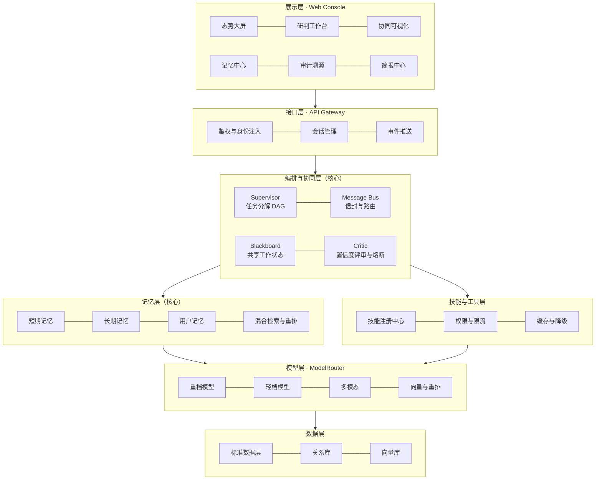

# ElcAgent · 电力气象防灾智能研判智能体

> 面向强监管能源行业的**多智能体协同研判系统**。本仓库当前处于**需求与设计阶段**，沉淀的是智能体功能设计，尚未进入编码实现。

---

## 一、这个项目在做什么

电网输电线路长期面临覆冰、大风、雷暴等气象灾害威胁。灾害预警到来时，现有处置流程存在三个结构性问题：

| 环节 | 现状 | 后果 |
|---|---|---|
| 数据拉通 | 设备台账、地理信息、气象、缺陷库等系统各自独立，编码与时间粒度不统一 | 人工逐线排查耗时长、易出错 |
| 风险研判 | 依赖运维人员经验判断 | 极端天气全省同时告警时无法逐线排查，存在漏判风险 |
| 材料制备 | 运维简报与灾情报告手工撰写 | 安监复盘要求可追溯，手工报告滞后于处置窗口 |

本项目的目标是把这条链路改造为**多智能体自动协同**：气象预警进入系统后，自动完成「数据口径统一 → 空间初筛 → 风险排序 → 规则校验 → 置信度评审 → 方案生成 → 简报初稿」的全链路，人工只做复核与签发。

**设计原则**：智能体输出「建议」而非「指令」，决策权保留在运维与安监。

---

## 二、三个核心模块（本项目的重心）

本项目的技术重心不在业务算法，而在**智能体的基础设施能力**。三块内容各自独立成章，是本仓库最值得读的部分：

| 模块 | 文档 | 解决什么问题 |
|---|---|---|
| **记忆系统** | [docs/02](docs/02_记忆系统设计.md) | 三层记忆（短期／长期／用户）、写入与检索流水线、冲突消解与版本链、记忆可解释性 |
| **多智能体通信** | [docs/03](docs/03_多智能体通信机制.md) | 统一消息信封、言语行为协议、混合编排拓扑、仲裁与熔断、全链路可观测 |
| **技能体系** | [docs/04](docs/04_技能体系设计.md) | 技能声明式规范、47 个技能分组清单、四级降级链、注册与治理 |

其余章节（整体架构、数据模型、前端设计、工程实施）服务于这三块，构成完整闭环。

---

## 三、架构总览

**一次研判的三条正交流**：控制流（任务 DAG 由谁在何时做什么）、数据流（中间产物如何在智能体间传递）、记忆流（什么被记住、什么被复用）。第三条独立成流，是本设计的核心特色——记忆不是藏在提示词拼接里的黑盒。

---

## 四、智能体编队

完整版 15 个智能体，分为编排、执行、监督三层：

| 层 | 智能体 |
|---|---|
| 编排 | 会话网关 · 主控调度 Supervisor · 记忆管家 |
| 执行 | 数据治理 · 气象解析 · 台账空间 · 历史案例 · 风险研判 · 图像判读 · 规则合规 · 方案生成 · 简报撰写 · 审计溯源 |
| 监督 | 置信度评审 Critic · 审批协同 · 用户画像 |

每个智能体以**声明式 Agent Card** 注册，明确其能力标签、输入输出契约、可调用的技能白名单、记忆读写权限、模型档位绑定与失败降级策略。详见 [docs/01](docs/01_整体架构与智能体设计.md)。

---

## 五、关键设计取舍

| 决策点 | 选择 | 理由 |
|---|---|---|
| 编排拓扑 | Supervisor 层级委派 + Blackboard 共享态为主，点对点与广播限用 | 强监管场景要求责任链清晰可追溯 |
| 是否用自由群聊式多智能体 | **不采用** | 对话图无法映射到责任链，且 token 成本不可控 |
| 风险打分 | 物理公式 0.45 + 规则 0.35 + 语义修正 0.20 | 数值结论必须可复算，不能由模型自由生成 |
| 物理计算是否交给模型 | **不交给** | 公式可复算、模型不可复现；安全生产评审不接受 |
| 记忆写入门槛 | 必须携带来源引用与置信度 | 无来源的知识不允许进入长期记忆 |
| 记忆冲突处理 | 保留版本链，不删除旧版 | 复盘场景必须能回答「当时依据的是哪一版口径」 |
| 数据取数入口 | 技能层唯一入口，智能体不直连数据库 | 审计留痕、权限拦截、口径统一、数据源可替换 |
| 原始数据是否进模型上下文 | **不进**，只给特征与结论 | 同时解决 token 成本、数值幻觉、结论可复算三个问题 |

---

## 六、文档索引

| 文档 | 内容 |
|---|---|
| [01 整体架构与智能体设计](docs/01_整体架构与智能体设计.md) | 六层架构、Agent Card 规范、15 个智能体职责、混合编排模型、任务 DAG 示例 |
| [02 记忆系统设计](docs/02_记忆系统设计.md) | 三层记忆分类、生命周期流水线、数据模型、混合检索与打分、冲突消解、可解释性 |
| [03 多智能体通信机制](docs/03_多智能体通信机制.md) | 消息信封规范、言语行为协议、通信模式、仲裁规则、熔断降级、安全与可观测 |
| [04 技能体系设计](docs/04_技能体系设计.md) | 技能声明规范、技能清单、与工具／MCP／智能体的边界、技能治理 |
| [05 数据模型与接口规范](docs/05_数据模型与接口规范.md) | 数据分层、核心表结构、消息与日志契约 |
| [06 前端与交互设计](docs/06_前端与交互设计.md) | 信息架构、页面设计、关键交互、实时数据契约、可视化方案 |
| [07 工程实施与验收](docs/07_工程实施与验收.md) | 模型选型与分层调度、技术栈、实施路径、验收标准、风险与降级预案 |

---

## 七、技术栈

| 层 | 选型 |
|---|---|
| 后端 | Python 3.11+ · FastAPI · Pydantic v2 · SQLAlchemy · asyncio 事件总线 |
| 存储 | SQLite / PostgreSQL · 向量库（Chroma / pgvector 二选一） |
| 模型 | 智谱 GLM 系列（分层调度：重档／轻档／多模态／向量与重排） |
| 推理运行时 | 本地 Ollama / vLLM · 或开放平台兼容接口，由配置切换 |
| 前端 | React 18 · TypeScript · Vite · TailwindCSS · ECharts · React Flow · MapLibre |

模型层通过 **ModelRouter 抽象**统一管理，业务代码只声明任务档位，不感知模型来源。本地私有化部署与云端接口之间切换无需改动业务逻辑。

---

## 八、范围与状态

| 项 | 说明 |
|---|---|
| 当前阶段 | 需求与设计（架构、契约、数据模型、交互均已定义） |
| 实现状态 | 未开始编码 |
| 范围边界 | 本项目为**能力验证型 Demo**，非生产系统 |

**非生产用途声明**：本项目用于验证多智能体协同架构的可行性，**不可直接用于工业生产环境**。工业落地还需补齐真实数据接入与脱敏管道、统一身份认证对接、安全加固、高可用与可运维能力、评测质量升级、合规与审计体系等前置工作。

---

## 九、关于数据

本仓库**只包含设计文档，不包含任何数据集**。

设计与开发过程中涉及的模拟数据**仅用于代码调试与功能测试**，目的是让各模块在无真实系统对接的情况下可被独立验证。此类数据不含任何真实企业信息或生产数据，其内容不构成对本项目能力的评估依据。

---

## 十、合规声明

- 本仓库不包含任何真实企业的名称、数据或生产系统信息。
- 文档中的业务场景描述为**基于行业公开常识的抽象化表述**，用于说明技术方案，不指向任何特定主体。
- 所有量化指标均为设计目标，非实测结果。
- 本项目为个人技术能力验证项目。

---

## 许可

本仓库文档内容为个人技术设计产出，保留所有权利。如需引用请联系仓库所有者。
