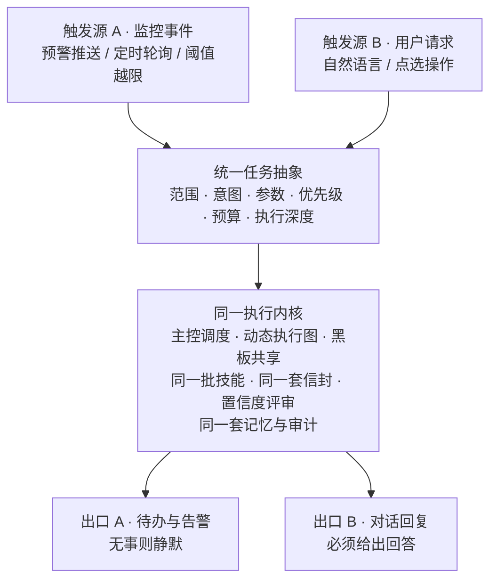
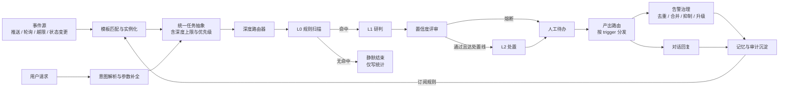

# 08 · 监控与交互的统一设计

> 本文说明系统两种工作方式——**监控（主动发现）**与**交互（按需响应）**——如何在同一个内核上统一，并补齐监控路径此前缺失的设计定义。

---

## 1. 问题

系统表面上有两种截然不同的工作方式：

| | 监控 | 交互 |
|---|---|---|
| 谁发起 | 系统自己 | 用户 |
| 什么时候 | 持续、按事件 | 按需 |
| 面向什么 | 全部线路与设备 | 用户关注的那一点 |
| 产出给谁 | 待办队列、告警面板 | 对话界面 |

如果按字面理解，很容易做成两套系统：一套轮询脚本 + 一套对话应用，各自有各自的数据口径和判断逻辑。**这是本设计要显式规避的结果。**

---

## 2. 结论：一个执行内核 + 两个触发适配器

**监控路径本质上是「无人值守的交互」——系统自己扮演用户，向自己提问。**

因此它不是与交互并列的第二套系统，而是交互路径的一个特例。两条路径的差异只存在于**入口和出口**，中间完全是同一条链路。



### 2.1 两条路径的差异对照

| 维度 | 监控路径 | 交互路径 |
|---|---|---|
| 触发 | 外部事件或定时器 | 用户请求 |
| 任务定义者 | 系统（套用预设监测模板） | 用户（自然语言或点选） |
| 入口执行深度 | 通常自 L0 进入 | 通常直接 L1 或 L2 |
| 作用范围 | 大（可能覆盖全部区段） | 小（用户指定范围） |
| 收敛方式 | 无事则静默，有事才产出 | 必须给出一个有内容的回答 |
| 输出目的地 | 待办队列 / 告警面板 / 简报 | 对话界面 |
| 节奏 | 持续、高频、可批量 | 单次、按需 |
| 成本约束 | **极严**（全量扫描不能调模型） | 宽松 |
| 优先级 | 按时段与等级动态调整 | 实时 |
| 失败处置 | 记录并重试，不打扰用户 | 必须明确告知用户 |

### 2.2 两条路径的相同点

以下全部共用，不做区分实现：

任务抽象 · 主控调度 · 执行图动态生成 · 技能层 · 消息信封 · 黑板共享态 · 置信度评审与熔断 · 三层记忆 · 审计留痕 · 模型路由 · 权限校验

**关键性质**：主控调度**不感知触发源**。它拿到的是规范化后的任务，不需要知道这次是系统自己发起的还是人问的。

---

## 3. 支点一：统一任务抽象

无论从哪条路径进入，第一步都规范化为同一个结构。

### 3.1 任务结构

| 字段 | 说明 |
|---|---|
| `task_id` / `trace_id` | 标识与追溯链 |
| `trigger` | `event` / `schedule` / `user` —— **仅供审计与优先级判定使用，下游不据此分支** |
| `trigger_ref` | 触发源引用（事件 ID / 定时任务 ID / 会话 ID） |
| `scope` | 作用范围：区段集合 / 线路集合 / 地市集合 |
| `intent` | 意图：风险评估 / 单点查询 / 简报生成 / 方案求解 / 数据核查 |
| `params` | 意图相关的参数 |
| `depth` | **执行深度上限**：`L0` / `L1` / `L2` |
| `priority` | `critical` / `high` / `normal` / `low` |
| `budget` | `deadline_ms` + `budget_tokens` + `max_agents` |
| `actor` | 发起身份（用户 ID 或 `system`），用于权限与记忆作用域 |
| `constraints` | 强制要求（如必须调用某技能、必须人工签发） |

### 3.2 两条路径的任务对照

| 字段 | 监控路径 | 交互路径 |
|---|---|---|
| `trigger` | `event` | `user` |
| `trigger_ref` | 预警报文 ID | 会话 ID |
| `scope` | 越限的 3 个区段 | 用户提到的线路集合 |
| `intent` | `risk_assessment` | `risk_assessment`（可能相同） |
| `depth` | `L1` | `L1` |
| `priority` | 由时段与等级推导 | 用户显式指定或默认 `normal` |
| `actor` | `system` | 用户 ID |

**规范化完成后，两者在下游完全不可区分。** 这是统一点一的意义所在。

### 3.3 触发源为什么要保留

既然下游不区分，为什么还保留 `trigger` 字段？三个用途：

1. **优先级推导**——监控路径的优先级由时段和等级自动计算，交互路径由用户决定；
2. **权限判定**——`actor` 为 `system` 时以系统权限运行，不受用户岗位视图限制；
3. **审计统计**——需要区分「系统自动发现」与「人工发起」来评估监控覆盖率。

保留是为了这三点，**不是为了在执行阶段分支**。

---

## 4. 支点二：三级执行深度

这是统一设计的枢纽，也是解决「监控不能太贵」的关键。

### 4.1 三级定义

| 深度 | 名称 | 做什么 | 是否调用模型 | 典型输出 |
|---|---|---|---|---|
| **L0** | 哨兵级 | 规则与公式全量扫描，逐区段计算基础风险分 | **否** | 越限清单（哪些区段需要关注） |
| **L1** | 研判级 | 加语义修正、历史案例召回、置信度评审 | 是（轻档为主） | 风险排序清单 + 因子拆解 |
| **L2** | 处置级 | 完整链路：方案生成、简报撰写、审批流 | 是（含重档） | 处置方案 + 简报初稿 + 人工待办 |

### 4.2 为什么必须分级

全量扫描的规模决定了不能每次都跑完整链路：

| 深度 | 单次调用模型 | 可批量性 | 适用规模 |
|---|---|---|---|
| L0 | 否 | 高（纯计算） | 全网全部区段，每次数据更新都能跑 |
| L1 | 是 | 中 | 数十个候选区段 |
| L2 | 是 | 低 | 个位数确认风险 |

**若取消分级、全量走完整链路**：成本随区段数线性上升且不可控，延迟无法满足时效窗口，且绝大多数正常区段会白白消耗算力。分级是把成本压在真正需要的地方。

### 4.3 升档条件

| 从 | 到 | 触发条件 |
|---|---|---|
| L0 | L1 | 任一规则命中；或基础风险分超过关注阈值 |
| L1 | L2 | 置信度评审通过 **且** 风险等级达到处置线 **且** 任务约束允许（监控路径默认不允许自动进入 L2） |

### 4.4 终止条件

| 情况 | 处置 |
|---|---|
| L0 全量扫描无命中 | **静默结束**，只留一条扫描统计记录，不产生任何告警与记忆 |
| L1 置信度不足 | 熔断，降级为人工待办（不进入 L2） |
| 预算耗尽 | 终止当前分支，保留已完成部分 |
| 监控任务且判定为已存在的未处理告警 | 静默更新，不重复推送 |

**「静默结束」是监控路径最重要的行为**——绝大多数扫描应当以静默收场。一个每次扫描都要输出点什么的监控系统，等于没有监控。

---

## 5. 支点三：记忆闭环

前两个支点解决的是「代码复用」，这一条解决的是「数据贯通」。**两者都做到，才叫真正统一。**

### 5.1 监控产出沉淀为记忆与审计

监控任务跑完，除输出待办外，还会：

| 写入 | 内容 | 类型 |
|---|---|---|
| 情节记忆 | 某时刻某区段达到某风险等级、依据哪批数据、结论是什么 | 全局 |
| 审计记录 | 完整 trace（消息、技能调用、模型档位、耗时） | 全局 |
| 扫描统计 | 本次扫描覆盖范围与命中数（不写记忆，只写统计表） | 全局 |

### 5.2 交互路径读取监控留下的记忆

用户之后问起时，读取的是监控任务留下的记忆与 trace，而不是重新计算一遍。

**这一条是判断统一是否真正成立的试金石**：如果监控不写记忆、不留 trace，用户早上问起时系统只能回答「告警就是这么弹出来的」——那就是割裂的。

### 5.3 交互路径反向配置监控

用户在对话中表达的持续性诉求，被解析为监控规则并写入规则库与用户记忆：

| 用户表达 | 解析结果 |
|---|---|
| 「以后坝上覆冰超过 10mm 就通知我」 | 监测规则：范围=坝上线路，条件=覆冰≥10mm，动作=通知该用户 |
| 「这个区段这段时间盯紧点」 | 临时加密监视规则（默认有效期 72 小时） |
| 「中风险以下的别打扰我」 | 该用户的告警等级下限偏好 |

**至此闭环完成**：监控 → 记忆 → 交互 → 更新监控规则 → 监控。

### 5.4 完整时序示例

| 时刻 | 事件 | 路径 |
|---|---|---|
| 02:00 | 时序数据更新 → L0 规则扫描全部区段 → 3 个区段越限 | 监控 |
| 02:01 | 自动升 L1 → 完整研判 → 置信度 0.83 → 通过 | 监控 |
| 02:02 | 生成待办 + 推送通知；情节记忆与 trace 落库 | 监控 |
| 08:00 | 值班人员到岗，看到待办 | — |
| 08:01 | 点开待办追问「为什么判定这三个区段」 | **交互** |
| 08:01 | 系统读取 02:01 那次任务的记忆与 trace 作答 | **交互** |
| 08:05 | 用户设置「以后超过 10mm 直接通知我」 | **交互 → 监控** |
| 次日 | 该规则生效，监控按此规则运行 | 监控 |

---

## 6. 事件源与触发机制

### 6.1 四类事件源

| 类型 | 例子 | 触发方式 | 频率 |
|---|---|---|---|
| 外部推送 | 气象灾害预警报文 | 被动接收 | 事件驱动 |
| 数据更新 | 气象与微气象时序数据入库 | 轮询检测增量 | 按数据粒度（如 15 分钟） |
| 阈值越限 | 观测值入库时即时判定 | 写库时同步判定 | 实时 |
| 状态变化 | 设备状态变更、工单流转 | 事件订阅 | 事件驱动 |

### 6.2 监测任务模板

系统自动发起任务时，并非凭空构造，而是套用预设模板：

| 模板 | 触发条件 | 范围 | 深度 | 输出 |
|---|---|---|---|---|
| MT-01 全网气象扫描 | 时序数据更新 | 全部区段 | L0 → 命中则 L1 | 无命中则静默；有命中则告警 |
| MT-02 预警响应研判 | 收到灾害预警报文 | 预警影响范围 | L0 → L1 | 风险排序清单 + 待办 |
| MT-03 重点区段加密监视 | 已确认风险区段 | 该区段集合 | L1 | 状态更新（不重复告警） |
| MT-04 设备状态巡检 | 设备状态变更 | 关联区段 | L0 | 异常清单 |
| MT-05 日报生成 | 定时（每日固定时刻） | 全域 | L2 | 简报初稿 |

**模板是配置而非代码**——新增一种监测场景只需新增一个模板，不需要改内核。

### 6.3 从事件到任务

```
事件发生 → 匹配模板 → 结合事件内容实例化 → 生成任务（含深度上限与优先级）→ 进入统一内核
```

匹配规则、模板定义、优先级推导表均外置为配置，支持运行时更新。

---

## 7. 告警治理

**一个会淹没使用者的监控系统还不如没有。** 本节决定系统是「帮手」还是「噪音源」。

### 7.1 告警生命周期

```
产生 → 去重 → 合并 → 定级 → 抑制判定 → 通知 → 升级 → 关闭
```

### 7.2 去重与合并

| 规则 | 内容 |
|---|---|
| 去重键 | `区段 + 灾害类型 + 时间窗` |
| 合并窗口 | 默认 30 分钟（可配） |
| 合并行为 | 同一键内的多次越限合并为一条告警，保留最高等级，累计发生次数 |
| 状态流转 | `活跃` → `已确认` → `处置中` → `已关闭` |

**没有合并机制的后果**：一个持续 6 小时的过程按 15 分钟粒度会产出 24 条同类告警，把真正的异常淹没掉。

### 7.3 抑制规则

| 场景 | 处置 |
|---|---|
| 该区段已有未处理的同类型人工待办 | 不重复推送，仅更新告警内容与次数 |
| 同一事件链的下游告警 | 只推根因告警，下游作为关联项挂在同一条下 |
| 处于计划维护窗口内 | 抑制（记录但不通知） |
| 同类告警在窗口内已达通知上限 | 抑制通知，保留记录 |

### 7.4 静默时段与分级推送

| 时段 | 高风险 | 中风险 | 低风险 |
|---|---|---|---|
| 工作时段 | 立即推送 | 立即推送 | 汇总为摘要，定时推送 |
| 非工作时段 | 立即推送 | 次日汇总 | 静默 |
| 维护窗口 | 抑制 | 抑制 | 静默 |

静默不等于丢弃——**所有被静默的告警仍在面板可见、仍写记忆**，只是不主动打扰。

### 7.5 升级与超时

| 机制 | 内容 |
|---|---|
| SLA 超时升级 | 告警超过设定时长未处理，逐级升级（值班员 → 专责 → 主管） |
| 风险升级重推 | 等级升高时重新推送，并标注为升级而非新告警 |
| 自动关闭 | 条件恢复正常且持续一段稳定时间后自动关闭，写一条关闭记忆 |

---

## 8. 监控结论的记忆沉淀策略

监控每次扫描都写记忆会导致记忆爆炸，必须有筛选与压缩。

| 规则 | 说明 |
|---|---|
| **只写状态变化，不写状态** | 从正常变为告警时写一条；持续告警期间不重复写 |
| **合并事件只写一条** | 同一事件的多轮扫描在事件关闭时合并为一条完整情节记忆 |
| **关闭时补全结论** | 记忆包含：起止时间、峰值、处置动作、最终结果 —— 这才是可复用的经验 |
| **静默扫描不留记忆** | 无命中的全量扫描只写统计表，不进记忆 |
| **低价值记忆加速归档** | 低等级且已关闭的监控记忆，归档期短于普通情节记忆 |
| **人工处置写反思记忆** | 人工修改了系统建议时，按既有规则写反思记忆 |

**核心原则：记忆记的是「发生过什么值得记住的事」，不是「系统扫描过什么」。**

---

## 9. 统一后的完整运行流程



闭环的最后一跳（`P → B`）就是第 5.3 节的「交互反向配置监控」——记忆中的订阅规则成为监控的输入。

---

## 10. 对内核设计的接口要求

以下五项属于**内核契约**，必须在契约冻结阶段确定，晚改代价大：

| # | 契约 | 说明 |
|---|---|---|
| 1 | 任务结构（Task） | 第 3.1 节的字段定义 |
| 2 | 深度路由器接口 | 输入任务，输出执行深度与所需智能体集合 |
| 3 | 产出路由器接口 | 依据 `trigger` 与结果类型分发到不同出口 |
| 4 | 事件订阅接口 | 事件源与模板的注册、匹配、优先级推导 |
| 5 | 告警治理接口 | 去重键、合并窗口、抑制规则的调用点 |

**设计约束**：深度路由器与产出路由器是内核仅有的两处「依据 `trigger` 分支」的位置。除此之外，任何模块都不得依赖触发源——**一旦有第三处，统一性就被破坏了**。

---

## 11. 验证清单

| # | 验证项 | 通过标准 |
|---|---|---|
| 1 | 事件触发能自动生成任务并执行 | 无需人工介入产出结果 |
| 2 | L0 扫描确实不调用模型 | 可通过模型调用日志验证为零 |
| 3 | 全量扫描无命中时静默结束 | 不产生告警、不写记忆，仅留统计 |
| 4 | 同一区段连续越限只产生一条告警 | 告警数不随时间线性增长，次数累计在同一记录上 |
| 5 | 已有未处理待办时不重复推送 | 第二次扫描只更新不通知 |
| 6 | 非工作时段的低风险告警不主动推送 | 面板可见但无通知 |
| 7 | 监控结论能被交互路径检索到 | 用户追问时能引用监控任务留下的记忆 |
| 8 | 用户订阅规则能反向生效 | 设置后监控按新规则触发并通知该用户 |
| 9 | 告警超时能逐级升级 | SLA 到期后升级并留痕 |
| 10 | 状态恢复后告警自动关闭并写记忆 | 关闭记忆含完整起止与处置过程 |

---

**上一篇**：[07 工程实施与验收](07_工程实施与验收.md)　·　**下一篇**：[09 执行图的动态生成机制](09_执行图的动态生成机制.md)
