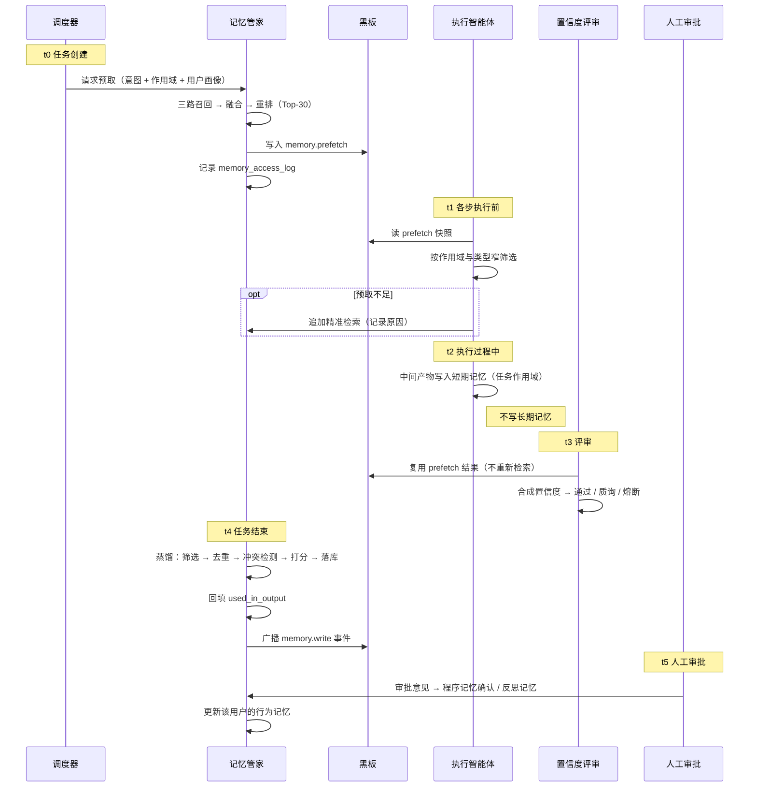

# 10 · 记忆流的检索与写入时序

> 本文定义一次任务中记忆的读取与写入时序。核心要回答三个问题：**什么时候读、什么时候写、谁保证一致。**

---

## 1. 问题

记忆系统最容易做错的地方不是检索算法，而是时序。三种典型错误：

| 错误做法 | 后果 |
|---|---|
| 每个智能体各自检索、各自写库 | 重复检索、写入路径不唯一、来源无法保证 |
| 中间产物全部写长期记忆 | 一次任务写几十条碎片，记忆爆炸、假冲突频发 |
| 任务中途记忆被更新 | 前半段与后半段判断依据不一致，审计无法解释 |

本文给出的时序设计，逐条规避这三点。

---

## 2. 记忆流的六个时刻

| 时刻 | 动作 | 触发者 | 写入层级 |
|---|---|---|---|
| **T-1 任务创建** | **预取**：宽召回，结果写入黑板 | 调度器 | — |
| **T-2 各步执行前** | **精准检索**：从预取结果中窄筛选，必要时追加检索 | 各执行智能体 | — |
| **T-3 执行过程中** | **中间写入**：只写短期记忆 | 各执行智能体 | 短期 |
| **T-4 任务结束** | **蒸馏写入**：统一判断哪些进长期记忆 | 记忆管家（独占） | 长期 |
| **T-5 人工审批后** | **反馈写入**：审批意见转程序/反思记忆 | 审批协同 → 记忆管家 | 长期 |
| **T-6 定时任务** | **衰减重算 · 巩固 · 归档** | 定时器 | 长期 |

**关键分界在 T-3 与 T-4 之间**：执行过程中只写短期记忆，长期记忆的写入集中在任务末尾一次性完成。

---

## 3. 两级检索：预取 + 精准检索

### 3.1 为什么要预取

如果不预取，八个执行智能体各自检索，会产生三个问题：

| 问题 | 后果 |
|---|---|
| 重复计算 | 相似查询被计算八次，延迟与成本叠加 |
| 结果不一致 | 不同智能体拿到的记忆版本可能不同，判断依据不统一 |
| 无法整体优化 | 每次检索只针对局部需求，无法用任务全局信息做一次更好的召回 |

预取解决这三点：**任务创建时做一次宽召回，结果放入黑板，各方复用。**

### 3.2 两级分工

| | 预取（T-1） | 精准检索（T-2） |
|---|---|---|
| 发起者 | 调度器 | 各执行智能体 |
| 查询构造 | 任务意图 + 作用域 + 用户画像 | 该步骤的具体子任务 |
| 召回宽度 | 宽（Top-30） | 窄（Top-6） |
| 目的 | 覆盖全局可能相关的内容 | 拿到本步真正需要的 |
| 成本 | 一次 | 按需，且多数情况下无需追加 |
| 结果位置 | 黑板 `memory.prefetch` | 步骤上下文 |

**设计要点**：预取结果放黑板，符合「大对象走黑板」的既有原则。消息里只传引用，不传记忆正文。

### 3.3 预取的查询怎么构造

```
预取查询 = 任务意图的语义描述
         ⊕ 作用域实体（线路名、区段号、灾害类型）
         ⊕ 当前用户的画像关键词（岗位、辖区、关注重点）
```

三部分拼接而非任选其一——只用语义会漏掉精确标识符（线路编码），只用实体会漏掉语义相关的历史案例。

### 3.4 窄筛选规则

各智能体从预取结果中筛选时，按作用域与类型过滤：

| 智能体 | 关注类型 |
|---|---|
| 数据治理 | 语义记忆（口径、映射标准） |
| 气象解析 | 语义记忆（阈值、术语） |
| 历史案例 | 情节记忆 + 程序记忆 |
| 风险研判 | 语义 + 情节（阈值口径与历史同类判断） |
| 置信度评审 | 情节（历史一致度） |
| 简报撰写 | 全部类型（含用户偏好） |

**当预取结果不足以支撑本步时**，允许追加一次精准检索，但需记录追加原因——这是优化预取策略的数据来源。

---

## 4. 执行过程中只写短期记忆

### 4.1 为什么

长期记忆写入是重操作：归一化 → 去重（向量比对）→ 冲突检测 → 重要度打分 → 落库 → 建索引。

如果每个智能体执行完都写长期记忆：

| 代价 | 说明 |
|---|---|
| 性能 | 一次任务可能触发二十余次重操作 |
| 质量 | 产生大量碎片条目（"某智能体输出了 X"这类无复用价值的内容） |
| 正确性 | 频繁触发假冲突（同一事实的不同表述被判为矛盾） |

### 4.2 中间写什么

执行过程中的产物只写入**任务级作用域的短期记忆**（工作记忆）：
- 本步骤的输入输出摘要
- 中间产物的引用
- 黑板快照

这类内容生命周期与任务绑定，任务归档即清理，不进入长期知识。

### 4.3 唯一的例外

若执行过程中**产生了明确的新知识**（例如人工在审批环节直接给出了一条新的阈值口径），可以走即时写入通道，但仍由记忆管家执行，且必须携带来源引用。**执行智能体本身永远没有长期记忆写入权。**

---

## 5. 任务末尾的统一蒸馏

### 5.1 蒸馏的四条判断标准

不是所有中间产物都值得进长期记忆。记忆管家在任务结束时逐条判断：

| 判断 | 写入类型 | 示例 |
|---|---|---|
| 产生了**新的可复用知识** | 语义记忆 | 新确认的阈值口径、新出现的地形分类 |
| 完成了**一次完整事件处置** | 情节记忆 | 某次覆冰事件的起止、峰值、处置动作、结果 |
| 沉淀了**一条可复用的执行路径** | 程序记忆候选（待审批确认） | 本次成功的方案编排序列 |
| 出现了**判断失误或人工修正** | 反思记忆 | 系统建议 X，人工改为 Y |
| **以上都不是** | **不写** | 绝大多数中间产物 |

**最后一行是关键**：绝大多数中间产物不该进长期记忆。这个筛选比"记得多"更重要。

### 5.2 蒸馏的执行步骤

```
① 收集：本次任务的短期记忆 + 产物摘要 + 评审结论 + 审批意见（若有）
② 筛选：按四条标准挑出候选
③ 归一化：统一术语与单位（复用治理层映射表）
④ 去重：与已有记忆做向量比对，相似度超阈值则更新而非新增
⑤ 冲突检测：与已有记忆矛盾时建立矛盾关系边
⑥ 冲突消解：按权威优先级裁决，无法裁决则标记待人工
⑦ 重要度打分：显式重要性 + 访问频次 + 结果反馈
⑧ 落库 + 建索引 + 广播写入事件 + 写审计
```

**幂等**：以 `task_id` 为幂等键，重复触发蒸馏只执行一次。

### 5.3 监控任务的蒸馏差异

监控路径（见 [08 监控与交互的统一设计](08_监控与交互的统一设计.md)）有两处额外约束：

| 约束 | 说明 |
|---|---|
| 静默扫描不留记忆 | 无命中的全量扫描只写统计表，不进记忆 |
| 事件合并后只写一条 | 同一事件的多轮扫描在事件关闭时合并为一条完整情节记忆（含起止、峰值、处置、结果） |

**「只写状态变化，不写状态」**——从正常变为告警时写；持续告警期间不重复写。

---

## 6. `used_in_output` 的回填

### 6.1 为什么需要回填

检索日志里有一列 `used_in_output`，标记这条记忆是否真的被最终结论采用。

**这个信息在检索时是不存在的**——检索的那一刻，谁也不知道这条记忆最终会不会被用上。只有任务结束时才知道。

所以必须在 T-4 阶段**回填**。

### 6.2 回填的依据

| 依据 | 说明 |
|---|---|
| 引用链 | 结论中显式标注的记忆引用（如简报的引用角标） |
| 消息上下文 | 各智能体在信封 `context_refs.memory_ids` 中声明的引用 |
| 产物溯源 | 最终产物中引用了哪些记忆 |

取三者并集，命中者标记 `used_in_output = true`。

### 6.3 为什么不能省这一步

没有这一列，记忆系统只能证明"我检索了"，无法证明"检索有用"。三个诊断问题都依赖它：

| 现象 | 结论 | 对应动作 |
|---|---|---|
| 检索命中率高但使用率低 | 召回不准 | 调整检索权重或提高重排权重 |
| 使用率高但查询重复度高 | 缺少相似记忆合并 | 触发巩固流程 |
| 长期零访问零使用 | 该记忆无价值 | 归档 |

**这是记忆价值评估的唯一数据来源，开发期最容易漏掉。**

---

## 7. 完整时序



---

## 8. 并发与一致性

多智能体并发时，记忆流的一致性靠四条规则保证：

| 问题 | 规则 | 说明 |
|---|---|---|
| 多智能体同时检索 | **预取 + 黑板共享 + 查询缓存** | 相同查询直接命中缓存，不重复计算 |
| 多智能体同时要写长期记忆 | **写入路径唯一** | 只有记忆管家能写，天然串行化，无并发写冲突 |
| 任务执行中记忆被外部更新 | **任务内使用快照** | 见下 |
| 同一任务重复蒸馏 | **幂等键 task_id** | 重复触发只执行一次 |

### 8.1 任务内快照语义（重要）

任务启动时对预取结果拍一个快照，**任务全程固定使用该快照**，不中途换版本。

**为什么必须这样**：假设任务执行到一半，某条记忆被另一个任务更新了。如果当前任务读到新版本，就会出现——

```
前半段判断依据：阈值 12mm
后半段判断依据：阈值 10mm
最终结论：按两种口径混合得出
```

这样的结论**无法审计**：任何人复盘都无法回答"当时依据的是哪一版口径"。

这是记忆的 **MVCC（多版本并发控制）语义**：读写不阻塞，但读者看到的是一个一致的历史快照。

### 8.2 快照的粒度

| 粒度 | 适用 |
|---|---|
| 任务级快照 | 默认。一次任务一个版本，最易解释 |
| 步骤级快照 | 仅当任务跨度过长（如跨天监控任务）时使用，需在任务记录中标注 |

---

## 9. 与另外两条流的关系

| 流 | 与记忆流的交互 |
|---|---|
| **控制流** | 通过 `depth` 决定是否启用记忆检索 —— **L0 不检索记忆** |
| **数据流** | 通过黑板传递预取结果，消息里只传引用 |

### 9.1 L0 不检索记忆

这条设计至关重要：哨兵级是纯规则与公式的全量扫描，**不需要历史知识**。如果 L0 也开始检索记忆，全省级别的扫描会变成性能灾难。

| 深度 | 记忆检索 | 理由 |
|---|---|---|
| L0 | **否** | 纯规则计算，无语义理解需求 |
| L1 | 是 | 需要历史案例与阈值口径 |
| L2 | 是 | 全部类型，含用户偏好与程序记忆 |

---

## 10. 反例：什么算是「假」的记忆流

| # | 反例 | 为什么是假的 |
|---|---|---|
| 1 | 每个智能体各自独立检索全部记忆 | 无可解释的引用链，重复计算 |
| 2 | 智能体可直接读写记忆库 | 写入路径不唯一，来源无法保证 |
| 3 | 中间产物全部写长期记忆 | 记忆爆炸、假冲突频发 |
| 4 | 检索后不记录使用情况 | 无法评估记忆价值 |
| 5 | 任务中途使用最新记忆版本 | 判断依据前后不一致，审计断裂 |
| 6 | 蒸馏与执行交织在一起 | 无法回答"这条记忆是哪一步产生的" |
| 7 | L0 也做记忆检索 | 成本失控，全量扫描不可行 |

---

## 11. 验证清单

| # | 验证项 | 通过标准 |
|---|---|---|
| 1 | 一次任务的检索次数远小于智能体数量 | 预取复用生效（如 8 个智能体只有 1–2 次实际检索） |
| 2 | L0 任务的记忆检索次数为零 | 从访问日志验证 |
| 3 | 长期记忆写入集中在任务末尾 | 写入时间戳聚集在 T-4 附近，而非散布全程 |
| 4 | 任务结束后 `used_in_output` 被正确回填 | 抽样比对引用链与标记 |
| 5 | 并发两个任务各自使用自己的快照 | 相互不干扰，各自结论可独立解释 |
| 6 | 同一任务重复触发蒸馏 | 只执行一次（幂等生效） |
| 7 | 静默监控扫描不产生记忆 | 记忆条数不变，仅统计表增长 |
| 8 | 事件合并后只写一条情节记忆 | 事件关闭时写入一条完整记录 |
| 9 | 无来源的记忆无法落库 | 缺 `source_ref` 时写入被拒 |
| 10 | 预取不足时可追加检索并记录原因 | 追加记录可见，用于优化预取策略 |

---

**上一篇**：[09 执行图的动态生成机制](09_执行图的动态生成机制.md)　·　**回到**：[README](../README.md)
